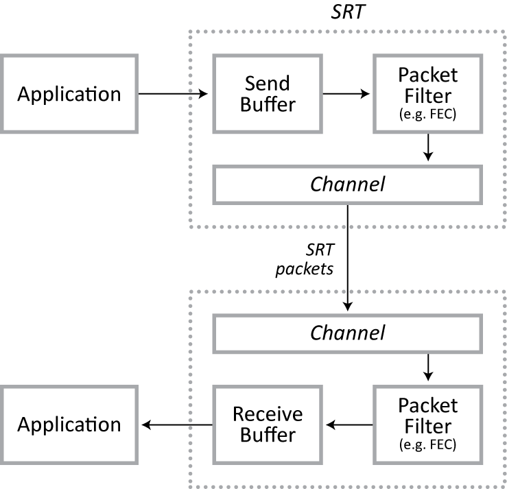
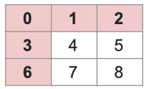
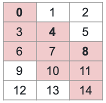
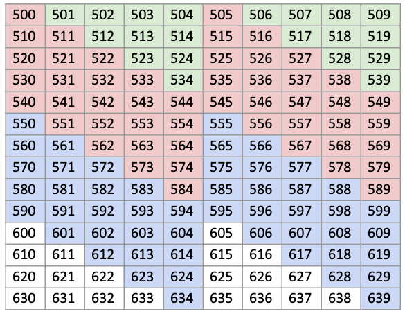
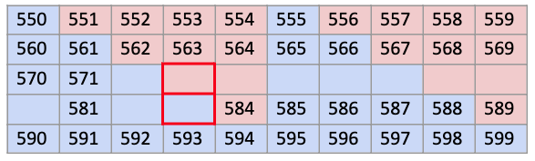
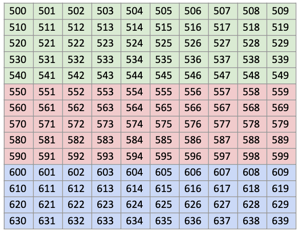
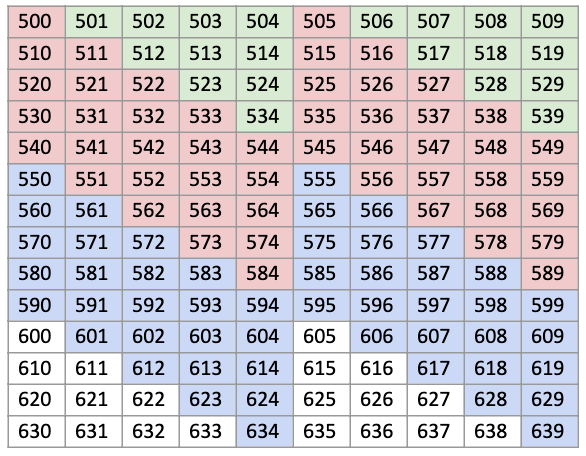
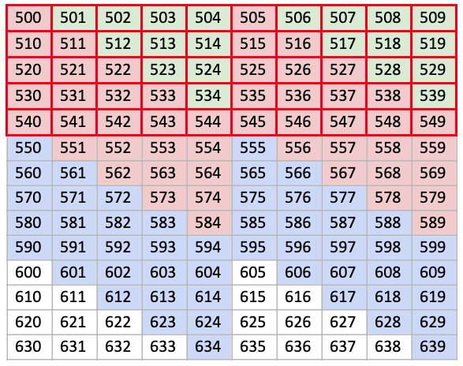

SRT Packet Filtering & FEC
==========================

- [**Introduction**](#Introduction)
- [**Configuration**](#Configuration)
  * [General syntax](#General-syntax)
  * [Configuring the FEC filter](#Configuring-the-FEC-filter)
  * [The motivation for staircase arrangement](#The-motivation-for-staircase-arrangement)
- [**The Built-in FEC Filter**](#The-Built-in-FEC-Filter)
  * [Sending](#Sending)
  * [Receiving](#Receiving)
  * [FEC Packet Header](#FEC-Packet-Header)
  * [Cooperation with retransmission](#Cooperation-with-retransmission)
  * [FEC Group Dismissal and Deletion](#FEC-Group-Dismissal-and-Deletion)
- [**Packet Filter Framework**](#Packet-Filter-Framework)
  * [Basic types](#Basic-types)
  * [Construction](#Construction)
  * [Sending](#Sending)
  * [Receiving](#Receiving)


# Introduction

SRT has a general-purpose mechanism for injecting extra processing instructions 
at the beginning and/or end of a transmission. This mechanism, based on packet 
filtering, was originally created as a means to implement Forward Error 
Correction (FEC) in SRT, but can be extended for other uses. 

As of SRT version 1.4 there is one built-in filter ("fec") installed, but more 
can be added.

# Configuration

## General syntax

SRT packet filtering can be configured by an `SRTO_PACKETFILTER` socket option,
which gets the configuration contents passed as a string. How this string is
interpreted depends on the filter itself. However, there is an obligatory
general syntax:
```
<filter-type>,<key>:<value>[,...]
```
The parts of this syntax are separated by commas. The first part is the name of 
the filter. This is followed by one or more key:value pairs, the interpretation 
of which depends on the filter type. Note that all keys and values are
case-sensitive.

You can try this out using the `SRTO_PACKETFILTER` option, or the
`packetfilter` parameter in an SRT URI in the applications.

The packet filter framework is open for extensions so that users may register
their own filters. SRT provides also one built-in filter named "fec". This
filter implements the FEC mechanism, as described in SMPTE 2022-1-2007.



On the input side, filtering occurs at the moment when a packet is extracted 
from the send buffer. A filter may then do two things:

* alter the packet before inserting it into the SRT channel (the built-in "fec"
  filter doesn't do it, though)

* insert another packet (such as an FEC control packet) into the channel ahead
  of the next waiting packet from the send buffer.

On the receiving side a packet is first reviewed by the filter, and then 
potentially passed to the receive buffer. In the case of FEC, the output of the 
filter may be:

* nothing (this happens when an FEC control packet is received but does not 
  trigger rebuilding)

* one or more packets (when together with a newly received packet the FEC
  filter succeeded to rebuild a lost packet)

## Configuring the FEC filter

To use the FEC filter, set `<filter-type>` in your configuration to `fec`.
Then add the appropriate key:value pairs based on the following parameters:

* **cols**: The number of columns in your FEC matrix (which is the equivalent of 
the size of each row). This parameter is obligatory and must be a positive 
number >=2.

* **rows**: The number of rows in your FEC matrix (which is the equivalent of 
the size of each column). This parameter is optional and defaults to 1. If the 
value is >=2, this corresponds to the exact number of rows. Beside this, two
other special cases are allowed:

    * 1: in this case you have a row-only configuration (no columns)

	* -N (where N >= 2): column-only configuration. In this case N designates
the exact size of a column, but the FEC control packet for rows will not be
generated (in other words, the **cols** parameter designates in this case only
a number of columns in one series)

* **layout**: The format of the FEC matrix. The possible values are:

    * **even**: block aligned (default) - columns are arranged in a solid matrix; 
    the first sequence numbers (SNbase) are all contained in one row:

    

    * **staircase**: non-block aligned - column starting points are staggered; 
    the first sequence numbers (SNbase) have an offset equivalent to R+1:

    


* **arq**: Optional use of the Automatic Repeat Request (ARQ) protocol. The 
possible values are:

    * **always**: ARQ is done in parallel with FEC (a loss is always reported 
    immediately once detected in SRT).

    * **onreq**: ARQ is allowed, but a loss is only reported when FEC fails to 
    rebuild, at the moment when an incoming packet has a sequence number that 
    exceeds the last in one of the column groups; such a packet, if still lacking 
    at that moment, is considered no longer recoverable by FEC.

    * **never**: ARQ is not done at all. Packets not recovered by FEC undergo 
    TLPKTDROP, just like those that fail ARQ recovery in a conventional SRT 
    exchange.

For example, this is how it should be used in the URI:
```
srt://recv.com:5000?latency=500&packetfilter=fec,cols:10,rows:5
```

As there can only be one configuration for both parties, it is recommended that one party
defines the full configuration while the other only defines the matching packet filter type
(for example, the sender sets `fec,cols:10,rows:-5,layout:staircase` and the receiver sets
just `fec`). Both parties can also set this option to the same value. The packet filter function 
will attempt to merge configuration definitions, but if the options specified are in
conflict, the connection will be rejected.

## **The motivation for staircase arrangement**

Normally, FEC is done using a solid (block aligned) matrix. Packet sequences are 
arranged in a two-dimensional array of R rows and C columns. With SRT, the 
problem is that the FEC control packets are only transmitted when the last row 
is retransmitted.

Let's imagine 10 columns and 5 rows starting from sequence 500. The rows begin 
with sequences numbers 500, 510, 520, 530 and 540 (where 540 is the start of the 
last row). Here is a representation of a series of packets transmitted starting 
from around the middle of the second-to-last row up until the end of the last 
row (H = horizontal position; V = vertical position):
```
...

<537>

<538>

<539>        -> end of the second-to-last row

<FEC/H:539>  -> row FEC packet for the second-to-last row

<540>        -> beginning of the last row; end of the first column

<FEC/V:540>  -> column FEC packet for the first column

<541>        -> end of the second column

<FEC/V:541>  -> column FEC packet for the second column

<542>

<FEC/V:542>  -> column FEC etc.

<543>

<FEC/V:543>

<544>

<FEC/V:544>

<545>

<FEC/V:545>

<546>

<FEC/V:546>

<547>

<FEC/V:547>

<548>

<FEC/V:548>

<549>        -> end of the last row; end of the last column

<FEC/H:549>  -> row FEC packet for the last row

<FEC/V:549>  -> column FEC packet for the last column
```
Given a constant bitrate at the input, there's a certain bandwidth normally used 
by the regularly transmitted data packets. But when the last row in a series is 
transmitted, the transmission will use twice the normal bandwidth because of all 
the column FEC packets.

There are three methods for mitigating this:

1. *Limit the bandwidth in SRT using* `SRTO_MAXBW`.

    This means that packets will not be transmitted as fast as the FEC mechanism 
requires, and will add extra delay to the transmission of regular packets. 
Normally, this shouldn't matter much, as there's already a very high minimum 
latency you must configure with FEC. This is based on the size of the matrix 
(50 in the above example), multiplied by the bitrate, divided by a 
bytes-per-packet factor. But if you use FEC and ARQ together, delaying a packet 
at the sender side may challenge the response time for retransmission.

2. *Delay sending the FEC control packet itself.*  **-> A concept, NOT IMPLEMENTED**

    Sending an FEC control packet can be postponed for several data packets. The
problem is that this would increase the time interval between the first packet
in a group and the control packet by a factor based on twice the matrix size
(100 in the above example), thus increasing the required latency penalty.

3. *Use the staircase arrangement.*

	While in a simple (block aligned) matrix, the packet sequence numbers at
the start of each column increment by 1, in a staircase (non-block aligned)
matrix arrangement, the packet sequence numbers at the start of each column
increment by R+1, where R is the row size. 

Let's again imagine a matrix of 10 columns and 5 rows starting from sequence 500. 
The rows begin with sequences numbers 500, 510, 520, 530 and 540. But the columns 
begin in staggered fashion, separated by an interval of R+1. The colours represent 
consecutive FEC groups (note the "staircase" pattern): 



Here is a representation of a series of packets transmitted starting from 
packet 537 (H = horizontal position; V = vertical position):
```
...

<537>

<538>

<539>

<FEC/H:539>  -> row FEC packet

<540>

<FEC/V:540>  -> column FEC packet

<541>

<542>

<543>

<544>

<545>

<FEC/V:545>  -> column FEC packet

<546>

<547>

<548>

<549>

<FEC/H:549>  -> row FEC packet

<550>  -> start of next FEC group

<551>

<FEC/V:551>  -> column FEC packet

<552>

...
```
Unlike with the block-aligned arrangement, the transmission of the FEC packets 
is well spaced, thus avoiding spikes in the use of available bandwidth.

Note that with the staircase arrangement, the initial packets sent when a 
connection is established will not be covered by an FEC group. But it is 
generally not a problem when packets are lost in the first 2 seconds of a 
transmission. If needed, even this can be mitigated by adding a series of unused 
groups to the FEC matrix before the transmission starts (a concept potentially
to be implemented).

Another advantage of the staircase arrangement is that it increases the 
probability of recovering a long sequence of a lost packets in a case when
consecutive lost packets in a row will belong to different column groups. In
the example below, it is likely that the entire missing sequence from 572 to
583 can be rebuilt, largely because packets 573 and 583 belong to different
groups (once these are rebuilt, it becomes possible to rebuild packets 572 and
582 via row FEC):



Although in a case of even arrangement you still may have a good luck of
having a long loss exactly at the border of two column series, the staircase
arrangement slightly increases the range of prospective long losses that can
be successfully recovered.


# The Built-in FEC Filter

The built-in FEC filter implements the standard XOR-based FEC protection 
operation. It qualifies packets into groups (see [Layout](#heading=h.wkpnk3l9ni7i) 
option). For every group, an FEC control packet is generated that can be used to 
rebuild a packet that was lost. 

The built-in FEC filter allows for the following possible configurations:

* **row only**: a row group is a range of consecutive packets; no columns are used

* **column only**: the row FEC packet is never sent

* **columns and rows**

A row is a series of consecutive packets from a base sequence number up to a 
number (N) of packets, with N being equal to the size of the row (R).

A column is a series of packets that starts at a base sequence number, with 
subsequent packets in the column group separated over an interval N (which is 
also the size of the row).

It's important to note that the size of a row (R) is equal to the number of 
columns, and the size of a column (C) is equal to the number of rows.

## Sending

Prior to sending, `feedSource` gets the packets to be sent so that their
contents can be XORed and written into the FEC group's buffer. Data on which
a protection operation is performed are:

* timestamp
* encryption flags
* content length
* contents - padded with zeros up to payloadSize()

For the timestamp recovery, the header field TIMESTAMP is reused. For all others 
there are extra fields in the payload space of the SRT packet:

* 8 bits: group index (for rows this is -1)
* 8 bits: flag recovery
* 16 bits: length recovery

When the number of packets, applied in a protection operation, reaches the
desired size of the group, the FEC control packet is considered ready for
extraction, and the current FEC buffer state (after processing all packets from
the group) becomes the required contents of the FEC control packet. This will
then be returned at the next call to `packControlPacket`. This function checks if
the FEC control packet is ready for extraction, first for the row group, then
for the column group, and provides it if it is ready.

An FEC control packet is distinguished from a regular data packet by having its 
message number equal to 0. This value isn't normally used in SRT (message numbers 
start from 1, increment to a maximum, and then roll back to 1).

Figure 1 - SRT data packet structure
```
   0                   1                   2                   3
   0 1 2 3 4 5 6 7 8 9 0 1 2 3 4 5 6 7 8 9 0 1 2 3 4 5 6 7 8 9 0 1
   +-+-+-+-+-+-+-+-+-+-+-+-+-+-+-+-+-+-+-+-+-+-+-+-+-+-+-+-+-+-+-+-+
   |0|                     Packet Sequence Number                  |
   +-+-+-+-+-+-+-+-+-+-+-+-+-+-+-+-+-+-+-+-+-+-+-+-+-+-+-+-+-+-+-+-+
   |FF |O|KK |R|                 Message Number                    |
   +-+-+-+-+-+-+-+-+-+-+-+-+-+-+-+-+-+-+-+-+-+-+-+-+-+-+-+-+-+-+-+-+
   |                          Time Stamp                           |
   +-+-+-+-+-+-+-+-+-+-+-+-+-+-+-+-+-+-+-+-+-+-+-+-+-+-+-+-+-+-+-+-+
   |                    Destination Socket ID                      |
   +-+-+-+-+-+-+-+-+-+-+-+-+-+-+-+-+-+-+-+-+-+-+-+-+-+-+-+-+-+-+-+-+
   |                                                               |
   |                             Data                              |
   |                                                               |
   +-+-+-+-+-+-+-+-+-+-+-+-+-+-+-+-+-+-+-+-+-+-+-+-+-+-+-+-+-+-+-+-+
```
Figure 2 - FEC control packet structure
```
   0                   1                   2                   3
   0 1 2 3 4 5 6 7 8 9 0 1 2 3 4 5 6 7 8 9 0 1 2 3 4 5 6 7 8 9 0 1
   +-+-+-+-+-+-+-+-+-+-+-+-+-+-+-+-+-+-+-+-+-+-+-+-+-+-+-+-+-+-+-+-+
   |0|                     Packet Sequence Number                  |
   +-+-+-+-+-+-+-+-+-+-+-+-+-+-+-+-+-+-+-+-+-+-+-+-+-+-+-+-+-+-+-+-+
   |FF |O|KK |R|               Message Number = 0                  |
   +-+-+-+-+-+-+-+-+-+-+-+-+-+-+-+-+-+-+-+-+-+-+-+-+-+-+-+-+-+-+-+-+
   |                     Time Stamp Recovery                       |
   +-+-+-+-+-+-+-+-+-+-+-+-+-+-+-+-+-+-+-+-+-+-+-+-+-+-+-+-+-+-+-+-+
   |                    Destination Socket ID                      |
   +-+-+-+-+-+-+-+-+-+-+-+-+-+-+-+-+-+-+-+-+-+-+-+-+-+-+-+-+-+-+-+-+
   |  Group Index  | Flags Recovery|        Length Recovery        | -> FEC header
   +-+-+-+-+-+-+-+-+-+-+-+-+-+-+-+-+-+-+-+-+-+-+-+-+-+-+-+-+-+-+-+-+
   |                                                               |
   |                     Payload recovery                          |
   |                                                               |
   +-+-+-+-+-+-+-+-+-+-+-+-+-+-+-+-+-+-+-+-+-+-+-+-+-+-+-+-+-+-+-+-+
```
## Receiving

The receiver must first determine whether the packet is a regular data packet or 
an FEC control packet. 

If the `getMsgSeq()` function returns 0 (signifying the packet is an FEC control 
packet), then the first byte from the FEC header in that packet is extracted to 
determine if this corresponds to a column FEC (contains the column number) or 
row FEC (contains -1).

If the `getMsgSeq()` function identifies a regular packet, then the packet is 
inserted into the horizontal and vertical position of the FEC group to which it 
belongs by performing the XOR operation with the current contents of the recovery
buffer and increasing the packets' count (the number of currently processed
packets in the FEC group buffer). Note that at the receiver there is only one
buffer for an FEC group. There's a counter that is incremented for each packet
on which the XOR protection operation has been performed and added to that
group's recovery buffer. This operation is done as well on the FEC control
packet, although this is marked by a separate flag.

The FEC control packet is inserted into the group to which it is destined (its 
sequence number is the last sequence in the group). Once you have a state where 
the group buffer contains the result of the XOR operation of the FEC control
packet and N-1 data packets from this group (with N being the size of the
group), the group is rebuild-ready, and the contents of a missing packet can be
rebuilt from the FEC group buffer contents.

Every incoming packet that is applied into the group also marks the reception
bit flag for its sequence number. The sequence number of the missing packet is
therefore determined by examining this flag for all these sequence numbers to
find out which one is missing. The packet is then rebuilt by:

* setting default values in the header (socket ID for the connection, message 
number 1)

* setting the sequence number to the number found for the missing packet

* setting the flags directly from the corresponding contents of the FEC group 
buffer (Flag Recovery from the FEC header);  the retransmission flag is always
set

* setting the timestamp directly from the corresponding contents of Time Stamp
Recovery

* reading the payload size from the corresponding contents of Length Recovery

* setting the payload contents from the corresponding contents of Data Recovery,
up to the payload size as read above

If both columns and rows are used, the rebuilding happens recursively - that is, 
after a packet is rebuilt its contents are also XORed to the row or column in 
the FEC group to which it simultaneously belongs, and then that row or column is 
checked again.That may trigger the rebuilding of another packet, which in turn 
causes a new column or row to be checked, and so on.

The rebuilt packets are stored in the provided array so that they can be picked 
up by SRT to insert them all into the receiver buffer.

## FEC Packet Header

In SRT, FEC control packets have an extra header so that all the recovery 
information can be contained. This is the breakdown of the FEC control packet:
```
   0                   1                   2                   3
   0 1 2 3 4 5 6 7 8 9 0 1 2 3 4 5 6 7 8 9 0 1 2 3 4 5 6 7 8 9 0 1
   +-+-+-+-+-+-+-+-+-+-+-+-+-+-+-+-+-+-+-+-+-+-+-+-+-+-+-+-+-+-+-+-+ ------
   |0|                     Packet Sequence Number                  |
   +-+-+-+-+-+-+-+-+-+-+-+-+-+-+-+-+-+-+-+-+-+-+-+-+-+-+-+-+-+-+-+-+
   |FF |O|KK |R|                  Message Number                   |   Regular
   +-+-+-+-+-+-+-+-+-+-+-+-+-+-+-+-+-+-+-+-+-+-+-+-+-+-+-+-+-+-+-+-+     SRT
   |                      Time Stamp Recovery                      |   header
   +-+-+-+-+-+-+-+-+-+-+-+-+-+-+-+-+-+-+-+-+-+-+-+-+-+-+-+-+-+-+-+-+
   |                    Destination Socket ID                      |
   +-+-+-+-+-+-+-+-+-+-+-+-+-+-+-+-+-+-+-+-+-+-+-+-+-+-+-+-+-+-+-+-+ -------
   |  Group index  | Flags Recovery| Length Recovery               | Extra FEC header
   +-+-+-+-+-+-+-+-+-+-+-+-+-+-+-+-+-+-+-+-+-+-+-+-+-+-+-+-+-+-+-+-+ -------
   |                    Payload Recovery...                        | Data

```
This is much like a regular data packet in SRT, except that there's an extra 32-bit 
special FEC header with additional information, and also many of the fields in the 
SRT header are used for a different purpose:

- **Packet Sequence Number:** Contains the sequence number of the last packet in 
the FEC group to which this FEC control packet is assigned.

- **FF (Packet position flag):** 11b (solo). FEC is currently used only in Live 
mode, where this is the only value that applies.

- **O (Deliver in order flag):** This flag is taken from the first data packet 
during sending and kept this way for all FEC packets, without checking other 
data packets. It's assumed that in Live mode all packets have this flag set 
the same way.

- **KK (Encryption flag):** 00b (unencrypted). The encryption specification doesn't 
apply to FEC control packets because the protection operation is being performed 
on the contents, whether they have been encrypted or not.

- **R (Retransmission flag):** 1 (set). An FEC control packet is marked as a 
retransmission to prevent it from being treated as a reordered packet.

- **Message Number:** 0 (a special value identifying an FEC control packet)

- **Time Stamp:** Contains the timestamp recovery (XOR)

- **Destination Socket ID:** Same as in regular SRT packets, as required to 
dispatch the packet to the correct socket.

- **Group Index:** Contains the column number, if it's for a column group, or -1, 
if it is for a row group. The only functional purpose of this field is to know 
whether this FEC control packet is for a row group or for a column group.

- **Flag recovery:** Contains the recovery bits to recover the flags preceding the 
Message Number field. Currently applies only to the **KK** flags, because 
encrypted packets may have KK set to 01 or 10 for the same transmission.

- **Length recovery:** 16-bit field containing the XOR of the packet length.

- **Payload recovery:** Contains the XOR-ed value of all payloads from packets in 
the group, each one padded with zeros before the operation up to `payloadSize()`.

For reference, here is the FEC header for transmission over RTP according 
to RFC 2733:
```
   +-+-+-+-+-+-+-+-+-+-+-+-+-+-+-+-+-+-+-+-+-+-+-+-+-+-+-+-+-+-+-+-+
   |      SN base                  |        length recovery        |
   +-+-+-+-+-+-+-+-+-+-+-+-+-+-+-+-+-+-+-+-+-+-+-+-+-+-+-+-+-+-+-+-+
   |E| PT recovery |                 mask                          |
   +-+-+-+-+-+-+-+-+-+-+-+-+-+-+-+-+-+-+-+-+-+-+-+-+-+-+-+-+-+-+-+-+
   |                          TS recovery                          |
   +-+-+-+-+-+-+-+-+-+-+-+-+-+-+-+-+-+-+-+-+-+-+-+-+-+-+-+-+-+-+-+-+
```
- **SNBase:** Minimum sequence number of the packets associated to the FEC packet, 
and where 16 bit sequence numbers are sufficient, this parameter shall contain 
the entire sequence number. For transport protocols with longer sequence numbers 
this field shall contain the least significant 16 bits of the sequence number.

- **Length Recovery:** This field should be used to determine the length of any 
media packets associated with the FEC packet.

- **PT recovery:** This field should be used to determine the Payload Type of any 
media packets associated with the FEC packet.

- **TS recovery:** This field should be used to recover the timestamp of any media 
packets associated with the FEC packet.

These fields have equivalents in the FEC control packet in SRT:

- **SNBase** (both low bits and ext bits): This is equivalent to 
the **Packet Sequence Number** (which is already 32-bit) since the sequence 
numbers used for FEC in SRT are just the existing sequence numbers.

- **Length recovery:** There's a similar **Length recovery** field in the extra 
FEC header.

- **PT recovery:** This field is specific to RTP, but is similar to 
the **Flag recovery** field.

- **TS recovery:** In SRT FEC the timestamp recovery is stored in the 
SRT header's **Timestamp** field (being Time Stamp Recovery in this case)

- **Index, Offset:** Some similarities can be found in the **Group index** field. 
However its purpose is mainly to distinguish row and column groups. The index 
itself is only for prospective sanity checks.

## Cooperation with retransmission

The ARQ level is a value that decides how the packet filtering should cooperate 
with retransmission. Possible values are:

- **NEVER**: Do not do retransmission at all. This means that packets are always 
ACK-ed up to the last sequence that is received, and all losses are ignored.

- **ALWAYS**: Do normal retransmission - that is, the retransmission request is 
sent immediately upon loss detection, possibly in parallel with FEC rebuilding. 
This might be useful for networks with high bandwidth capacity that happen to 
be very unstable; working with both FEC and ARQ on the same edge increases the 
probability that whatever can't be restored by one system will be restored by 
the other as fast as possible. However, both ARQ and FEC overheads will apply.

- **ONREQ**: Lost packets are recorded by SRT, but the loss report is not sent 
unless a sequence is reported in `loss_seqs` (see "Receiving" in the **Packet Filter 
Framework** section for details on how packets that are not recoverable by FEC 
are reported). Note that in this case the lost packets will be reported with a 
delay. At very low latency there is very little time to recover by ARQ in 
general, and with the added delay incurred by using this option there is even 
less, to the point where it may always be too late to retransmit.

Note that in ALWAYS and NEVER modes the filter should not return anything 
in `loss_seqs`.

It's very important that the latency is properly set. The FEC mechanism may 
rebuild a packet, but it's delivery will be delayed by the time it takes for 
enough packets to be accumulated in the corresponding group to trigger the 
rebuild. The minimum value for the delay due to rebuilding is based on the 
number of packets:
```
N = (R * (C-1)) + 2 
```
(where R = row size, and C = column size). 

The SRT latency should be set such that, given the current bitrate, it is at 
least equal to the time it takes to send the N packets in an FEC group, and even 
this minimum should be increased by an extra safety margin. If this condition 
isn't met, the TLPKTDROP mechanism may drop packets even if they can be rebuilt.

The standard recommended minimum ARQ latency for SRT is estimated as 4 * RTT. 
If you choose to use FEC in cooperation with ARQ with the **ALWAYS** level, your 
latency penalty should be the maximum of the standard ARQ latency and the FEC 
latency (which usually means that only the FEC latency penalty should apply). 
If you use the **ONREQ** level, your latency penalty should be the sum of 
these two.

With the ONREQ setting, the built-in FEC filter collects the sequence numbers 
of all packets that are lost and no longer recoverable. This is recognized by 
the fact that a packet has come with a sequence number that is past the last 
sequence number for a particular group. All groups for which this packet is 
"in the future" are dismissed, that is, the irrecoverable packets are reported 
at this call and the dismissed flag is set so that it's not reported again. 
Note that this group isn't physically deleted at this time.

## FEC Group Dismissal and Deletion

At some point, row and column groups are dismissed, which means that they are 
no longer of use. Missing packets are reported as irrecoverable, and the group 
is marked dismissed (so that this happens only once). This happens upon arrival 
of a packet with a sequence number that is higher than that of the last sequence 
number in the group.

Dismissed FEC groups (and objects representing them) are deleted when no longer 
needed. This happens when the whole series of groups is already in the past 
relative to the incoming packet.

Column and row groups are arranged in series, where the earliest active series 
is 0, the next is 1, and so on. When series 0 is deleted, series 1 becomes the 
new series 0. A column or row group is always deleted with the entire series 
to which it belongs (never by itself).

For block-aligned (even) FEC arrangements, a series is easily defined as all 
column and row groups that fit in a given size of matrix. All groups are deleted 
by deleting the entire matrix. In the figure below, with a matrix size of 5 rows 
by 10 columns, the green region of column and row groups (series 0) is deleted 
once a packet (#550 or later)  from the red region (series 1) arrives.




For non block-aligned (staircase) FEC arrangements, a series has a more complex 
definition, and the trigger for deletion comes later (and may therefore use more 
memory for FEC groups than an even arrangement). Let's look at a specific example. 
In the figure below (also a matrix size of 5 rows by 10 columns), we can define 
packet #500 as base0 - the very first sequence number in a group that is still 
active. Red then represents series 0, blue series 1, and white series 2:




In a staircase arrangement, the minimum distance between base0 and the first 
incoming packet that might trigger deletion is two times the size of the matrix 
(an arbitrary value chosen for the sake of simplicity and to provide a small 
margin of safety; it doesn't impact the functionality because deletion is 
independent of dismissal, except for the fact that the latter must happen first).
For example, deletion of the column and row groups in series 0 (the red region) 
will be triggered by reception of packet #600 (or greater, because packets can 
be lost). 

Once the trigger packet arrives, all column groups belonging to series 0 (red) 
are deleted, as well as all rows that begin with packets from the base0 column 
group - that is, all rows whose first packet falls in the sequence from #500 to 
#540. In the figure below, deletion of series 0 corresponds to columns with a 
red background and rows with a red border:




After the red series 0 is deleted, packet #550 becomes the new base0, packets in 
the column from #550 to #559 define the new first row group, and the blue packets 
become series 0.

When column groups are in the staircase arrangement, the penalty for loss 
detection (encountered with the ONREQ level) shall be always counted as the size 
of the matrix (a product of both group sizes). A certain number of packets must 
be received after the packet that caused a loss detection in order for the FEC 
facility to report it as lost and not recoverable. In other words, the FEC 
penalty is the number of packets between the lost packet and the first packet 
that triggered sending a loss report for that lost packet. The FEC mechanism 
always waits for the moment when the lost packet is declared irrecoverable.

# Packet Filter Framework

The built-in FEC facility is connected with SRT through a mechanism called 
"packet filtering". This mechanism relies on the following checkpoints which 
allow for packet filter injection:

* Sending:

    * a filter is first asked if it is ready to deliver a control packet; if so 
    it is expected to deliver it, and this packet is sent instead of a data 
    packet waiting in the sender buffer

    * when a new packet in the sender buffer is about to be sent over the network, 
    it's first passed to the filter

* Receiving:

    * Every packet received from the network is passed to a filter, which can:

        * pass it through 

        * provide extra packets

The built-in FEC filter doesn't use all capabilities of Packet Filtering, 
in particular:

* a packet may be altered prior to sending; FEC only reads the data.

* a receiver does allow packet passthrough; it must process each packet and put 
all results into a provisional buffer(\*). Note that the FEC filter does allow 
passthrough for regular data packets, but traps all FEC control packets and 
provides rebuilt packets.

    (\*)
*This provisional buffer is the socket's receiver buffer that is passed to the
packet filter framework to accommodate packets coming out of the packet filter
(see the *provided* constructor parameter in the __Construction__ section 
below).*

The sending and receiving mechanism of packet filtering is defined in one class. 
SRT is generally bidirectional, so both directions must be covered in a single 
mechanism.

A user-defined packet filter should be a class derived from `SrtPacketFilterBase` 
class, and it should override several virtual methods, as specified below.

## Basic types

The basic packet structures are:

* `CPacket` is an internal SRT class, that is, it gives you access to the exact 
packet to be used in the operation.

* `SrtPacket` is a special intermediate class, which has a static definition and 
is used as an intermediate space to be copied to the `CPacket` structure when 
needed, automatically. This is required for cases when SRT is doing some specific 
memory management. The packet filter framework cannot reuse the same memory 
management for keeping the packets in the receiver buffer, or have access to it. 
Therefore a filter should provide packets using appropriate methods, and SRT 
internals will take care of copying it to the receiver buffer. This is why the 
`CPacket` structure cannot be used for that purpose. 

Both classes - while characterized by completely independent contents and 
methods - implement a common C++ concept consisting of the following methods:

* `char* data();`

    * Returns the buffer in the packet.

* `size_t size();`

    * Returns the size of the contents in the buffer. Note that this is not the 
    size of the buffer itself.

* `uint32_t header(SrtPktHeaderFields field);`

    * This accesses the header. The field type specifies the field index in the 
    header. Note that if a function gives you writable access to `CPacket`, you 
    can modify the payload, but you can't modify the header. With `SrtPacket` you 
    are free to modify any contents, but to access the header you should use the 
    `SrtPacket::hdr` field, which is the array to be indexed by values of 
    `SrtPktHeaderFields` type.

## Construction

The constructor of the packet filter class should have the following signature:
```
MyFilter(const SrtFilterInitializer &init, std::vector<SrtPacket>& provided, const string &confstr);
```
Here `MyFilter` is the example filter class derived from `SrtPacketFilterBase`. The 
following parameters are required:

* `init`

    * This should be passed to the constructor of `SrtPacketFilterBase`. It will 
    provide you with the basic data you will need when creating a packet at the 
    receiver.

* `provided`

    * This is the provisional buffer where you have to store packets that your 
    filter will generate as extra packets (in the case of FEC, this is where the 
    rebuilt packets will be supplied).

* `confstr`

    * This is a configuration string. You should parse it using `ParseFilterConfig` 
    so that you can use it for your purposes. Note that this configuration string 
    is still parsed by this function internally in SRT, so the official syntax 
    must be preserved.

The base class will provide you with important data from the socket through the 
following methods:

* `socketID()`

    * The socket ID that you should write into the ID header field on the receiver 

* `sndISN()` and `rcvISN()`

    * It returns the very first sequence number in a particular direction (FEC 
    uses it to initialize the base sequence numbers for FEC groups). 

* `payloadSize()`

    * The maximum size of a single packet. This determines how large a content 
    payload should be used for the FEC control packet. The FEC control packet's 
    payload recovery field must be of the maximum size of any packet, and any 
    shorter packets being protected must be padded with zeros up to this size.

The following virtual methods (to be overridden) are not direction related:

* `size_t extraSize()` [REQUIRED]

    * Should return the size of the extra header that your filter will use, in 
    the count of 32-bit data. The current FEC implementation returns 4 here, 
    which is the size of the extra header in FEC control packets. Your 
    implementation may use some extra header in regular packets as well, so 
    this should be taken into account here. This is required 
    for checking if the `SRTO_PAYLOADSIZE` socket option is properly set (it 
    puts an extra limitation on the value for this option beside the overall 
    maximum of 1456 bytes).

* `SRT_ARQLevel arqLevel()` [OPTIONAL; default implementation returns the value extracted earlier from the configuration string under the `arq` key]
    * Should return the ARQ level in the case where you want it to be specified 
    differently than the default (for example, if you don't want it to be 
    configurable in your implementation).


## Sending

Sending in SRT is driven by a congestion control mechanism that determines when 
a socket is ready to send data at the currently defined speed. There is a 
function called at the precise moment when a socket should provide a packet to 
be sent over the UDP link.

There are currently three packet providers. When one provides a packet, the 
provision is done and the others will have to wait until the next opportunity. 
The providers are checked in a specific order:

- **Case #1**: A packet required for retransmission. This is based on the sender 
loss list, updated from `UMSG_LOSSREPORT` messages.

- **Case #2**: If a Packet Filter is installed, the filter's control packet, if 
one is ready.

- **Case #3**: The next waiting data packet.

For Case #3, this function is called on the filter (if it is installed):
```
void feedSource(CPacket& pkt);
```
This function is called at the moment when a packet (already submitted by the 
`srt_sendmsg` call) is picked up from the sender buffer and is going to be sent. 
Note that this packet is bound to a buffer representing the input, and its size 
is set to the maximum possible (see **NOTE** below). Since this packet is 
allowed to be altered, data can also be extended up to this size. Note that if 
such a packet is altered, it will stay in this form in the sender buffer and be 
retransmitted, if needed.

The current FEC filter implementation uses this function only to collect the 
contents of the packet to be XORed into an FEC group buffer.

For Case #2, a filter control packet is provided by this function:
```
bool packControlPacket(SrtPacket& packet, int32_t seq);
```
If the function returns *true*, it means that it has supplied the packet. The 
function should return *false* when there is no such packet ready, in which event 
Case #3 (new data packet) will be attempted.

**NOTE**: If *true*, the contents of the filter control packet are to be written 
in a special packet buffer, from which the contents will be copied to the target 
packet. This buffer is already the maximum possible size of a single packet in SRT.

Special control packets are distinguished from regular data packets by the 
Message Number (MSGNO) field. For control packets the Message Number is always 0, 
while regular data packets have Message Numbers from 1 up to a maximum (after 
which they roll back to 1). For that reason, you are free to store special 
values in TIMESTAMP and SEQNO fields, but the MSGNO and ID fields must be left 
alone (they will be overwritten anyway).

## Receiving

There is just one function for receiving:
```
bool receive(const CPacket& pkt, loss_seqs_t& loss_seqs);
```
This function is called for any data packet received on a socket. It is 
understood that this is a data packet, the rest is up to the receive() function. 

A packet received here must not be altered. However, you can decide whether a 
given packet should be passed through, or dismissed, based on the return value. 
Returning *true* means that the received packet should be passed on to the 
receiver buffer; otherwise it is discarded. If you have some special contents 
in a packet that you want removed, simply recreate the packet, then discard the 
original.

If you want to inject a packet from a filter (such as an FEC-rebuilt packet), 
you store it in a provisional buffer (the reference to which you received in 
the constructor). This method can also be used when you want to replace a packet. 
The order in which packets are stored in this array doesn't matter, because they 
will be sorted by sequence number order before they are returned to SRT.

Here are some additional considerations related to the `receive()` function:

1. It's up to you to distinguish regular data packets and filter control packets 
by checking the message number. It is important to use the `CPacket::getMsgSeq` 
function for that purpose because this extracts the right part of the MSGNO field 
from the header - `pkt.header` (`SRT_PH_MSGNO`) will return just the field, which 
contains extra flags.

2. If you use an extra header for every packet, be sure that you can recognize 
it correctly as you have created it.

3. When creating (reconstructing) a packet, you have to correctly set the 
sequence number, the ID field (get the value from `socketID()`), timestamp, and 
the encryption flags (other flags are not important, they are set as default).
