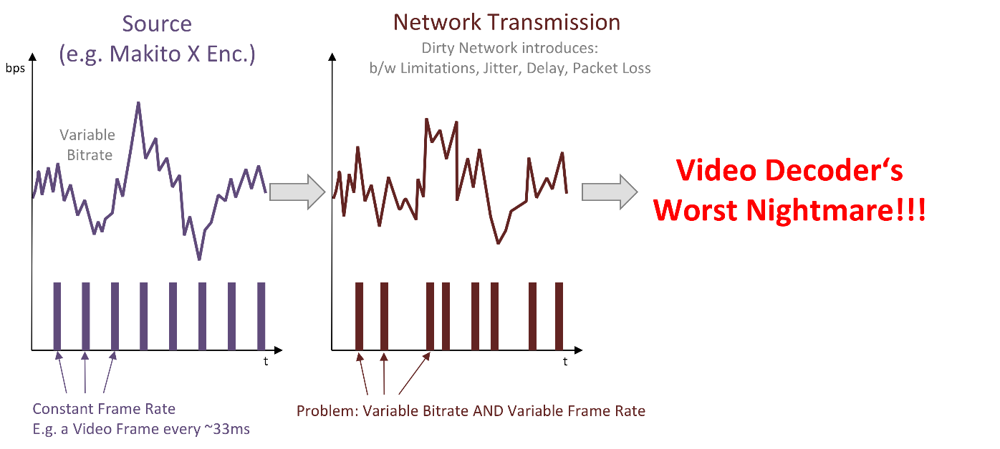

Some people have asked us why we're using the UDT library within our SRT protocol. Actually, some people claimed that SRT is just a slightly modified version of UDT and that UDT is known to be useless for live video transmission. Guess what, the latter is true. UDT has been designed for high throughput file transmission over public networks. However, SRT is far from being a slightly modified version of UDT. I'll get into the details, but will start with a little bit of history.

Haivision has always been known for lowest latency video transmission across IP based networks, typically MPEG-TS unicast or multicast streams over the UDP protocol. This solution is perfect for protected networks and if packet loss became a problem, enabling forward error correction (FEC) fixed it.
At some point we were getting questioned whether it would be possible to achieve the same latency between customer sites in different locations, between different cities, countries or even continents. Of course it's possible with satellite links or dedicated MPLS networks, but those are quite expensive solutions, so people wanted to use their public internet connectivity instead. While it's possible to go with FEC in some cases, that's not a reliable solution, as the amount of recoverable packet loss is limited, unless you accept a significant amount of bandwidth overhead.

After evaluating the pros and cons of different third party solutions, we found that none satisfied all our requirements. Particularly the lack of insight into the underlying technology drove us to the decision to develop our own solution, which we then could deeply integrate into products. That way, it would become the "glue" that enables us to transmit streams between all our different products, locally or across far distances, while maintaining our low latency proposition.

There were a few of possible choices to consider:
- The TCP based approach. Problem for live streaming: Network congestion, too slow packet loss recovery.
- The UDP based Approach. General problem: Packet loss, jitter, packet re-ordering, delay
- Reliable UDP. Adds framing and selective retransmit.

Having had a history with UDT for data transmission, I remembered its packet loss recovery abilities and just started playing with it. Though not designed for live streaming at all, it kind of worked when using really big buffers. I handed it over to one of our extremely talented networking guys in the embedded software team (thanks, Jean!) and asked him whether he'd be able to make this a low latency live streaming solution. I didn't hear anything back for quite a while and had almost lost my hope, when he contacted me to tell me he had to rewrite the whole packet retransmission functionality in order to be able to react to packet loss immediately when it happens and that he added an encryption protocol, which he had specified and implemented for other use cases before. Nice :-)

We started testing sending low latency live streams back and forth between Germany and Montreal and it worked! However, we didn't get the latency down to a level we had hoped to achieve. The problem we faced turned out to be timing related (as always in media ...).

What happened was this:

The characteristics of the original stream on the source network got completely changed by the transmission over the public internet. The reasons are delay, jitter, packet loss and its recovery on the dirty network. The signal on the receiver side had completely different characteristics, which led to problems with decoding, as the audio and video decoders didn't get the packets at the expected times. This can be handled by buffering, but that's not what you want in low latency setups.

The solution was to come up with a mechanism that recreates the signal characteristics on the receiver side. That way we were able to dramatically reduce the buffering. This functionality is part of the SRT protocol itself, so once the data comes out of the SRT protocol on the receiver side, the stream characteristics have been properly recovered.

The result is a happy decoder:

We publicly showed SRT (Secure Reliable Transport) the first time at IBC 2013, where we were the only ones to show an HEVC encoded live stream, camera to glass, from a hotel suite outside the exhibition directly onto the show floor, using the network provided by the RAI. Everybody who has been at such a show before knows how bad these networks can get. And the network was bad. So bad that we expected the whole demo to fall apart, having pulled the first trial version of SRT directly from the labs. The excitement was huge, when we realized that the transmission still worked fine!

Since then, we added SRT to all our products, enabling us to send high quality, low latency video from and to any endpoint, including our mobile applications. Of course there were improvements to be made and the protocol matured on the way. Until NAB 2017, where we announced that SRT is now Open Source.

Marc
